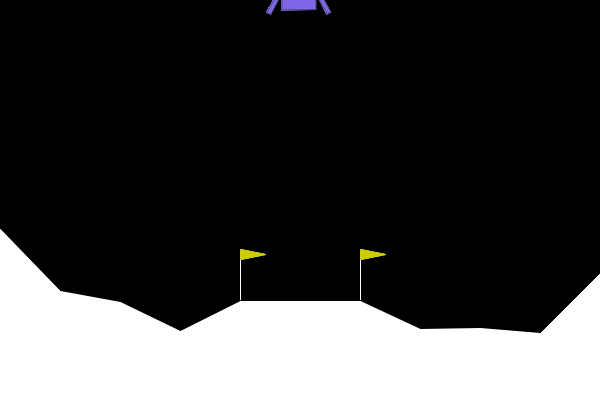

## Comparison of the robustness of Deep Q-Networks (DQN) and REINFORCE in the event of sudden system changes in the LunarLander environment / Comparison of the robustness of Value- and Policy-Based learning in the event of sudden system changes in the LunarLander environment

### 1. Solving LunarLanding environment
Solving the LunarLanding environment, with Value- and Policy-Based learning, with turbulance (Gadgil et al., 2020; Guttulsrud et al., 2023).

### 2. Random Engine Failure
Another source of uncertainty in the physical world can be random engine failures due to the various unpredictable conditions in the agent’s environment. The model needs to be  robust enough to overcome such failures without impacting performance too much. To simulate this, we introduce action failure in the lunar lander. The agent takes the action provided 80% of the time, but 20% of the time the engines fail and it takes no action even though the provided action is firing an engine (Gadgil et al., 2020; Shah & Yao, 2023).

### 3. Engine Failure Scenarios
This project will examine two sources of uncertainty in order to understand how Deep Q-Networks and REINFORCE will respond to these occurrences.

#### Random Engine Failure

    Scenario 1: 80% probability of success of the selected action

    In this scenario, the action selected by the agent works in 80% of the time and in 20% of the cases the action is replaced by a “zero action” (i.e. no engine fires, even if the agent has selected an action). This scenario examines the robustness of the agent against systemic uncertainties.

#### Central Engine Failure

    Scenario 2: 80% probability of success for a specific engine (e.g. main engine)

    In this scenario, the middle engine is selected to malfunction 80% of the time, which results in action 0 being executed (no engine fires), whereas it operates as expected 20% of the time. This scenario examines how the agent can deal with the uncertainty of a specific engine failure, especially when the affected engine plays a central role in controlling the system.

### LunarLanding

#### Discrete Action Space
4 discrete action
- 0: do nothing
- 1: left engine
- 2: main engine
- 3: right engine

##### Reason for the discrete action space

1. DQN is designed for discrete actions
DQN is specifically designed for discrete action environments where the agent can choose from a limited set of actions (Mnih et al., 2015). The discrete version of the LunarLander environment fits this type of algorithm perfectly, as the agent has to choose from a fixed set of actions.

2. REINFORCE works well with discrete actions
Even though REINFORCE is a policy gradient algorithm that can also be used in continuous environments, it will typically be easier to implement and test in discrete environments, especially if you use the classical variants of REINFORCE without further modifications.

3. Implementation and comparison are simpler
The discrete version of the LunarLander environment provides a clearly defined set of possible actions (e.g. turning different thrusters on or off), which simplifies the implementation and comparison of the two algorithms. In a continuous environment, you would work with continuous action settings, which could make the comparison and analysis of the two algorithms more complex. The discrete actionspace reduces complexity and focuses on the essential aspects of agent robustness in relation to system disruptions.

#### Observation Space
8-dimensional vector
- Position in x- and y-coordinates
- Velocity in x- und y-direction
- Angle
- Angle velocity
- One Boolean value per leg, for ground contact